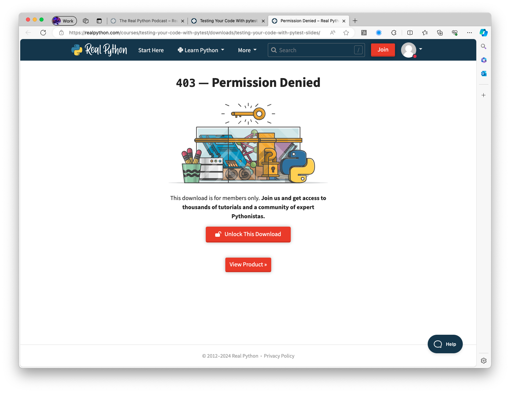
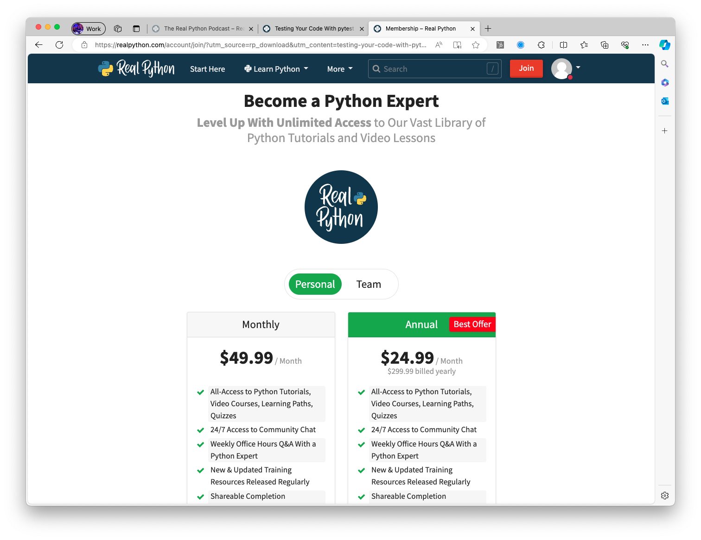

# Welcome

This project explores my thoughts and ideas while reviewing the free ~25-minute [Testing Your Code With Pytest](https://realpython.com/courses/testing-your-code-with-pytest/) course.

## Getting started

First things first. Let's download the slides and the sample code for this free course.

NOT SO FAST.





Well, that's a bit of a downer. I wasn't expecting a paywall to prevent me from downloading course material. My suggestion? Either make it a paid course upfront or remove this silliness. This is dumb. 👎🏻

Make sure that you have created a virtual environment for development:

```sh
# Verify that you have Python installed on your machine
% python3 --version
Python 3.11.1

# Create a new virtual environment for the project
% python3 -m venv .venv

# Select your new environment by using the Python: Select Interpreter command in VS Code
#   - Enter the path: ./.venv/bin/python

# Activate your virtual environment
% source .venv/bin/activate
(.venv) %
```

Please see [CHEAT-SHEET-PYTHON.md](./CHEAT-SHEET-PYTHON.md) for more examples of getting started with Python development on your machine.

## Testing Your Code With pytest (Overview)

## Using pytest

```sh
# Install pytest to your virtual environment
(.venv) % pip install pytest

```

### Let's look at the built-in unittest library

Let's look at [./unit_sample/test_unit_sample.py](./unit_sample/test_unit_sample.py).

This file looks at using the built-in `unittest` library in Python.

```sh
# Navigate to our directory
(.venv) % cd unit_sample

# Run unittest
(.venv) % python3 -m unittest
F.
======================================================================
FAIL: test_always_fail (test_unit_sample.SampleTestCase.test_always_fail)
----------------------------------------------------------------------
Traceback (most recent call last):
  File "/Users/rob/repos/real-python/testing-your-code-with-pytest/unit_sample/test_unit_sample.py", line 8, in test_always_fail
    self.assertTrue(False)
AssertionError: False is not true

----------------------------------------------------------------------
Ran 2 tests in 0.000s

FAILED (failures=1)

```

### Let's look at writing these tests using pytest

Let's look at [./pytest_sample/test_pytest_sample.py](./pytest_sample/test_pytest_sample.py).

This file looks at using pytest.

```sh
# Navigate to our directory
(.venv) % cd pytest_sample

# Run pytest
(.venv) % pytest

# Run pytest in quiet mode
(.venv) % pytest -q
```

In addition to looking for functions, pytest also looks for classes that have `Test` as the prefix name - like our file at [./pytest_sample/test_klass.py](./pytest_sample/test_klass.py) - that also has methods inside of them with a `test_` prefix.

### We can also use marks to identify tests to execute

Let's look at [./marks/test_marks.py](./marks/test_marks.py). We need to create a [./pytest.ini](./pytest.ini) file to register our desired `mark` names.

```sh
# Navigate to our directory
(.venv) % cd marks

# View all default and custom markers
(.venv) % pytest --markers

# Run our smoke test(s) - identified by @pytest.mark.smoke
(.venv) % pytest -m smoke

# Run our regression test(s) - identified by @pytest.mark.regression
(.venv) % pytest -m regression
```

Additional markers include:

- `skip` - Skips a test
- `skipif` - Skips a test if the accompanying expression is True
- `xfail` - Mark that a test is expected to fail (and does not cause the suite to fail when the expected test fails)
